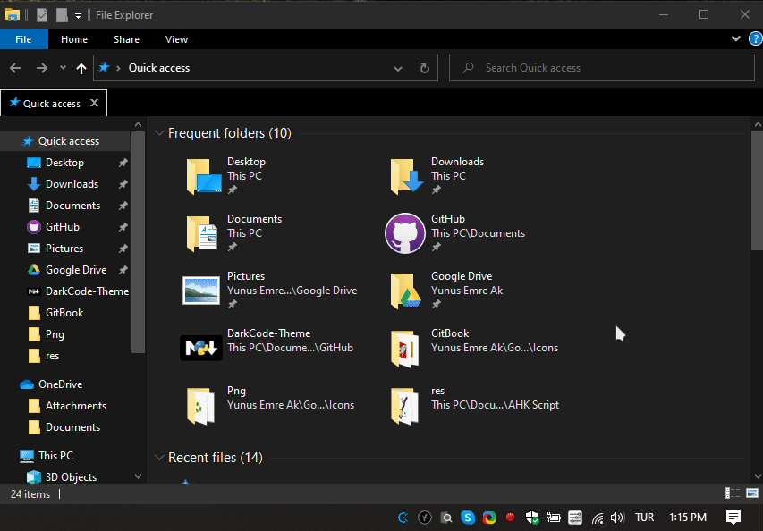
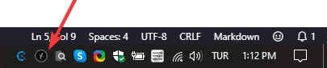
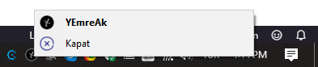
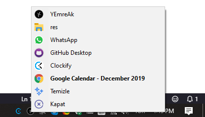

# 👨‍💼 YWinManager

## 👁‍🗨 Uygulamaya Bakış

## 💞 Kısayollar

### Tray Icon Kısayolları

| 🎹 Buton                      | 📑 Açıklama      |
| ----------------------------- | ---------------- |
| <kbd>❖ Win</kbd> <kbd>E</kbd> | File Explorer    |
| <kbd>❖ Win</kbd> <kbd>W</kbd> | Whatsapp Desktop |
| <kbd>❖ Win</kbd> <kbd>G</kbd> | GitHub Desktop   |
| <kbd>❖ Win</kbd> <kbd>C</kbd> | Google Calendar  |

### 👀 Küçült / Göster Kısayolları

| 🎹 Buton                      | 📑 Açıklama    |
| ----------------------------- | -------------- |
| <kbd>❖ Win</kbd> <kbd>Q</kbd> | One Note       |
| <kbd>❖ Win</kbd> <kbd>T</kbd> | Tureng         |
| <kbd>❖ Win</kbd> <kbd>G</kbd> | GitHub Desktop |

### 📂 Dizin Kısayolları

| 🎹 Buton                           | 📑 Açıklama |
| ---------------------------------- | ----------- |
| <kbd>PgDn</kbd> <kbd>g</kbd>       | GitHub      |
| <kbd>PgDn</kbd> <kbd>s</kbd>       | Shrarex     |
| <kbd>PgDn</kbd> <kbd>⇧ Shift</kbd> | Startup     |
| <kbd>PgDn</kbd> <kbd>i</kbd>       | Icons       |
| <kbd>PgDn</kbd> <kbd>d</kbd>       | Downloads   |
| <kbd>PgDn</kbd> <kbd>u</kbd>       | Yedhrab     |

### 👨‍🔧 Buton Düzeltmeleri

| 🎹 Buton                          | 📑 Açıklama |
| --------------------------------- | ----------- |
| <kbd>✲ Ctrl</kbd> <kbd>PgDn</kbd> | Page Down   |
| <kbd>✲ Ctrl</kbd> <kbd>PgUp</kbd> | Page Up     |

## 👨‍💻 Geliştirici Notları

İstersen kod içerisinde en altta bulunan kısayolları değiştirebilirsin

### 🍍 Kısayol Tanımlamaları

| Sembol | Açıklama                                                                                             |
| ------ | ---------------------------------------------------------------------------------------------------- |
| #      | Win (Windows logo key)                                                                               |
| !      | Alt                                                                                                  |
| ^      | Control                                                                                              |
| +      | Shift                                                                                                |
| &      | An ampersand may be used between any two keys or mouse buttons to combine them into a custom hotkey. |
s
